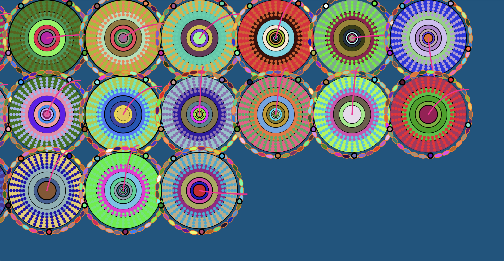

# Functional-prototype
### Interactive description with work

- Personal animation group code method details
  1. drawConcentricCircles(x, y, size) : Draw concentric circles, drawing multiple layers of concentric circles according to the given center coordinates and dimensions, and gradually decreasing the level size.
  2. drawEllipsesAroundCircle(centerX, centerY, circleSize) : Draws ellipses around a circle, the number and position of which depend on the given center coordinates and the size of the circle.
  3. drawZigzagLines(centerX, centerY, circleSize) : Draw zigzaglines, drawing lines in a zigzag shape along the perimeter of a given circle to create a dynamic effect.
  4. DrawFilledSurroundingCircles (centerX, centerY, circleSize) : filling and around the circle inside the small circle, small circle the location and size of the dynamic determined according to the size of the circle.
  5. drawSurroundingCircles(centerX, centerY, angle, numCircles, circleSize) : Draw small external circles around a large circle, with the position and number of small circles depending on the given parameters.
  6. drawExtendingLine(centerX, centerY, circleSize) : Draw an extension line that starts at the center of a given circle and extends a dynamically changing curve.
  7. animate() : A method of controlling the animation effect by updating the position or properties of the circle based on changes in time or other parameters.

- Animation driven
  I choose to use a time-based approach to drive my personal code. Through the control of timer and frame rate, the animation can gradually draw circles and make dynamic changes.
   
- Animation of image properties
   1. Appearance of circles: The position, size, and color of the circles gradually change so that they appear on the canvas one after the other.
      
      
   2. Overall animation effect: The movement, rotation, and color changes of circles are driven by time to present a dynamic and smooth visual effect.
      
      
   
- Inspiration
  1. Appearance of circles: Inspired by the image below, my animation attempts to simulate this free-flowing form, The speed and frequency with which the circular patterns appear one by one also reflects this rhythmic atmosphere.
   
   
   
   [Link text](https://openprocessing.org/sketch/2230988)

  2. Overall animation effect: My animations create a vibrant and dynamic atmosphere through colorful colors. The color rhythm changes, creating a visual rhythm that echoes the effect of LED lights flashing on the surface of the CD player.
   
  
- Technical specification
  1. By controlling the circlesDrawn variable, the circle is gradually drawn on the canvas to simulate the process of the CD player LED light gradually turning on.
     
  2. The setInterval function periodically invokes the animate method to update the position and properties of the circle every 300 milliseconds, producing a dynamic effect.
     

- Change description
  1. I added a counter circlesDrawn to draw circles step by step.
  2. The animate method was added to allow the circle to change dynamically after the drawing is complete.
  3. The circle drawing logic was adjusted to dynamically calculate the number and position of circles based on the screen size.

